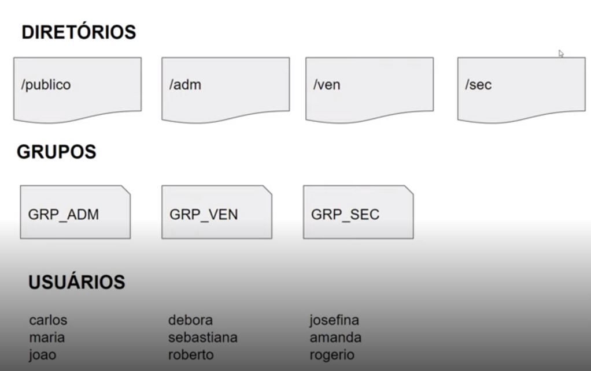

# Infraestrutura como código

- Infraestrutura como código (IaC) é o gerenciamento e provisionamento da infraestrutura por meio de códigos, em vez de processos manuais.
  - Facilita edição e distribuição de configurações, assegura o provisionamento do mesmo ambiente todas as vezes, reduz o erro humano, reduz trabalho manual.
  - Controle de versão é importante, e a IaC faz parte do projeto do aplicativo

## O projeto

- Todo provisionamento deve ser feito em um arquivo do tipo Bash Script
- O dono de todos os diretórios criados será o usuário root;
- Todos usuários terão permissão total dentro do diretório `publico`;
- Os usuários de cada grupo terão permissão total dentro de seu respectivo diretório;
  - Os usuários não poderão ter permissão de leitura, escrita e execução em diretórios de departamentos que eles não pertencem.
- Subir arquivo de script criado para a sua conta no GitHub.

- > cat /etc/passwd

  - Para saber quem são os usuários

- > userdel -r <nome_usuario>

  - Remover usuários com a sua pasta home

- > cat /etc/group

- > groupdel <nome_grupo
